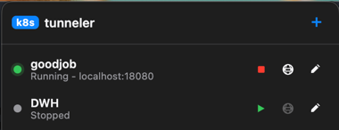
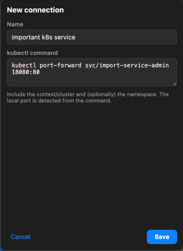

# k8s tunneler

A menu bar / tray app for managing `kubectl port-forward` connections across
multiple clusters and namespaces. Store your port-forwards once, then start,
stop, and open them in the browser from a small window attached to the menu bar
icon. Primarily built for macOS, with Linux support via a tray icon and app
window.

<p align="center">
  
</p>

## Why

If you routinely run `kubectl port-forward` against several clusters and
namespaces, you end up juggling long commands and orphaned terminal tabs. k8s
tunneler keeps each forward as a named connection with a play/stop toggle and a
live status indicator, so you can see and control everything from one place.

## Features

- Lives in the menu bar - click the icon to open an attached mini window.
- Store connections with a name and a full `kubectl port-forward` command
  (including the cluster/context and, optionally, the namespace).
- Per-connection status dot (stopped / starting / running / error) and a
  play/stop button to toggle the forward.
- Open-in-browser button that launches the locally forwarded port (the local
  port is detected automatically from the command).
- Add, edit, and delete connections; they persist across restarts.
- The menu bar icon gains a green dot whenever a forward is active.

## Screenshots

### Managing connections

Each row shows the connection name, its status, and quick actions (start/stop,
open in browser, edit). A running forward shows its local address.


### Adding a connection

Give the connection a name and paste the `kubectl port-forward` command. The
local port is parsed from the command for the open-in-browser action.



## Requirements

- macOS (Apple Silicon or Intel), or Linux.
- A working `kubectl` on your `PATH` (or at `~/google-cloud-sdk/bin/kubectl`).
  The app resolves `kubectl` and augments `PATH` with common locations
  (Homebrew, `~/google-cloud-sdk/bin`) so cluster auth plugins such as
  `gke-gcloud-auth-plugin` work when launched as a GUI app.
- Node.js and npm (for running from source / building).

## Getting started

```bash
npm install
npm start
```

On macOS the app runs as a pure menu bar app (no Dock icon): click the menu bar
icon to open the popover window, and right-click it for a Quit option.

On Linux it runs as a tray icon plus a normal app window as fallback (mostly for GNOME).
Click the tray icon (or use its context menu's "Open") to show the window;
closing the window hides it back to the tray, and "Quit" fully exits.
Note that some desktop environments (notably stock GNOME) need a tray/AppIndicator
extension for the tray icon to appear.

### Adding a connection

1. Click the `+` button.
2. Enter a name and a `kubectl port-forward ...` command, for example:

   ```
   kubectl port-forward -n my-namespace svc/my-app 8080:80
   ```

3. Save, then press play to start the forward. Once it is running, the browser
   button opens `http://localhost:8080`.

## Build a distributable app

macOS (produces an installable `.dmg` in `dist/`):

```bash
npm run dist
```

The macOS build is unsigned, so on first launch you may need to right-click the
app and choose **Open** to get past Gatekeeper.

Linux (produces an `AppImage` in `dist/`):

```bash
npm run dist:linux
```

Run the resulting file with `chmod +x *.AppImage && ./k8s\ tunneler-*.AppImage`.

## How it works

- **Electron main process** owns the connection store and child processes. It
  spawns the system `kubectl` for each active forward and tracks its status by
  watching for the `Forwarding from 127.0.0.1:PORT` line on stdout.
- **Renderer** is a small UI that talks to the main process only through a
  `contextBridge` preload API (context isolation on, node integration off).
- **Storage** uses `electron-store`, persisting connections as JSON in the app's
  data directory.

## Project layout

```
src/
  main.js              Electron main process: tray, window, IPC, tray indicator
  connectionManager.js Store-backed CRUD + kubectl spawn/stop + port parsing
  preload.js           contextBridge API bridging renderer <-> main
  renderer/            Mini window UI (index.html, styles.css, renderer.js)
assets/                Menu bar tray icons (template + active variants)
build/icon.png         Application icon (converted to .icns at build time)
scripts/gen-icon.js    Generates all icon assets
```

## Security considerations

A few things worth knowing about how the app runs:

- **It launches your login shell at startup.** To pick up variables like
  `KUBECONFIG` (which a GUI app launched from Finder/Dock would not otherwise
  inherit), the app runs your login shell once in interactive mode
  (`$SHELL -ilc`), which sources your profile (e.g. `.zshrc`/`.zprofile`). This
  means your normal shell startup code runs. The app only reads the resulting
  environment variables - it does not evaluate or forward anything else from
  your profile.
- **Stored commands are executed with your `kubectl`.** Each connection's
  command is run using your system `kubectl` and your active kube credentials,
  so treat stored connections as trusted input. The app parses the command into
  arguments and runs the `kubectl` binary directly (it does not pass your
  command to a shell for interpretation, so there is no shell globbing or
  command chaining), but it will still run whatever `kubectl` subcommand/args
  you save.
- **Connections are stored in plaintext.** They live as JSON in the app's data
  directory (via `electron-store`). No secrets are stored - just the name and
  the command string - but anything you put in the command is saved as-is.
- **Everything stays local.** The app itself makes no network calls and sends no
  telemetry; the only outbound activity is whatever `kubectl` does and opening
  `http://localhost:<port>` in your browser.
- **Builds are unsigned.** The packaged app is not code-signed or notarized, so
  your OS will warn on first launch.

## License

Released under the [MIT License](LICENSE).
